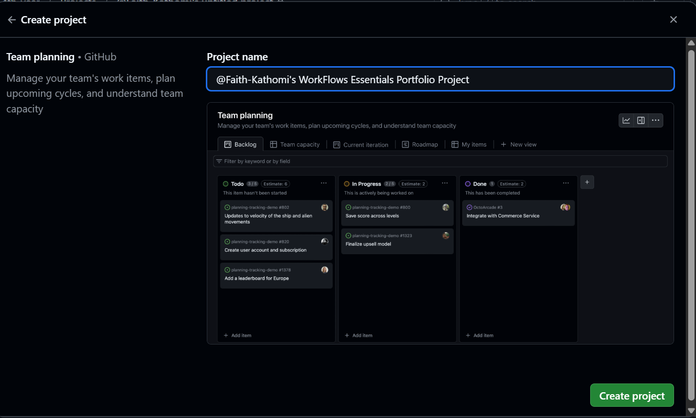

# Personal Portfolio Documentation

## 1. Student Details

- **Full Name**: Faith Kathomi Kithinji
- **Admission Number**: 151674
- **GitHub Username**: Faith-Kathomi
- **Email**: Faith.Kithinji@strathmore.edu

## 2. Deployed Portfolio Link

- **GitHub Pages URL**:  
  _(https://is-project-4th-year.github.io/build-your-portfolio-github-workflow-essentials-Faith-Kathomi/)_

## 3. Learnings from the Git Crash Program

**🧠 What I Thought I'd Learn vs What I Actually Learned**

**1. Concept: Branching**

`Expectation 👀`: I assumed branching was mostly useful for large team-based projects and wouldn’t really help me in a personal project.

`Reality 😅`: I realized that branching is essential even in solo work! It let me experiment with different sections (like About Me and Admin Panel) without disrupting the main version.

`Impact 💡`: I used branches to test changes to the hero section layout and color themes, and then merged the final version once I was satisfied.

---

**2. Concept: Issues and Milestones**

`Expectation 👀`: I thought issues and milestones were extra work and mostly for software developers working on complicated systems.

`Reality 😅`: They actually helped me stay organized and manage tasks step-by-step. I could clearly track what needed to be done and check off completed items.

`Impact 💡`: I created a milestone for launching the full portfolio layout and tracked individual tasks like setting up dark mode and improving responsiveness.

---

**3. Concept: Pull Requests**

`Expectation 👀`: I thought pull requests were mainly for developers working in teams to review code.

`Reality 😅`: Even working alone, PRs helped me document changes and understand what I was modifying, which was useful for catching mistakes before they went live.

`Impact 💡`: I submitted pull requests when merging feature branches into main, like the one for my updated “About Me” section, and reviewed changes before merging.

---

**4. Concept: Merge Conflicts**

`Expectation 👀`: I didn’t expect to have conflicts while working alone, so I didn’t think I’d need to understand this part.

`Reality 😅`: I triggered a conflict while editing the same line from two branches and had to fix it manually.

`Impact 💡`: I learned how to identify the conflicting lines and resolve them using VS Code and the Git CLI. Now I feel confident handling merge conflicts on my own.

---

## 4. Screenshots of Key GitHub Features

### A. Milestones and Issues

I used milestones to group related issues for each major section of my portfolio. This helped me break down the work and stay on track.Below is an example of of the issues under the milestone for Developing the about page for Kelly's personal portfolio

### B. Project Board

I created a GitHub Project Board to visually track progress during development. Tasks were moved across columns — "To Do", "In Progress", and "Done" — to help me prioritize and stay focused.

### C. Branching

To work on different parts of my portfolio independently, I created multiple branches. This ensured I could test features without affecting the main user experience.

### D. Pull Requests

Here's a screenshot of a pull request I made to merge my past projects branch to the services section of my portfolio.

### E. Merge Conflict Resolution

While merging the changes i had made in one branch i received some conflicts

Below is a photo of the resolved conflict

